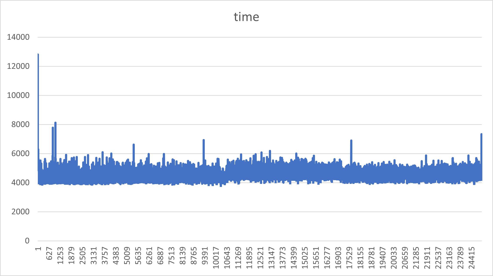
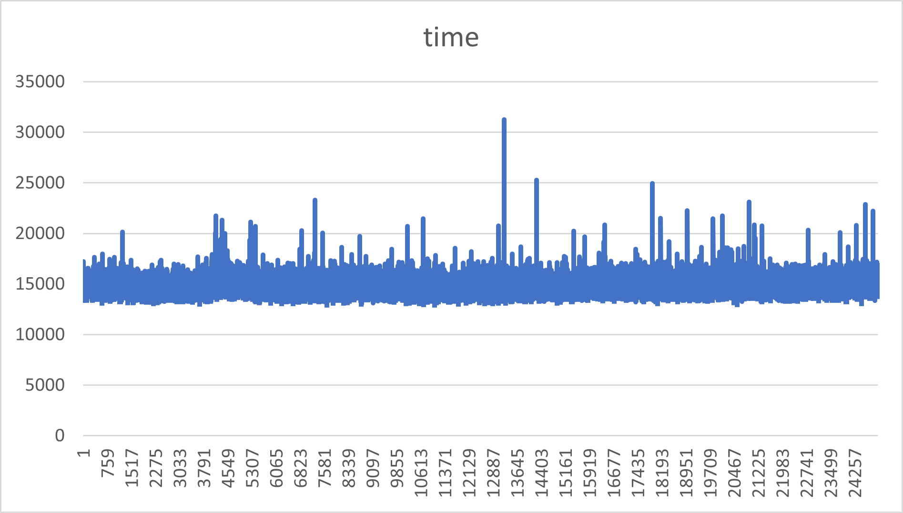

# cuda_neural_nets

This was done as part of an assignment in the CS 547 - High Performance Computing course under [Prof. Kenneth Chiu](https://www.binghamton.edu/computer-science/people/profile.html?id=kchiu). 

<span style="color:red">

_The work done here may only be used as reference material. The work here is not to be submitted as your own, with or without edits._ 

</span>

---

Compiling and Running the CUDA Neural Network

```
$ make main
$ ./main 
```

Compiling and Running the Sequential Neural Network

```
$ make sequential
$ ./sequential 
```

---

## Write-Up

### Different Modules

- The MNIST database (Modified National Institute of Standards and Technology) database is a large database of handwritten digits that is commonly used for training various image processing systems. It consists of about 60000 training images and 10000 test images along with their corresponding labels.

- Created a separate MNISTDataset class to deal with reading and loading the MNIST dataset as batches.

- Used thrust::host_vector and thrust::device_vector for representing all weights, matrices, and for transferring data between device and host. 

- Used raw_pointer_cast to cast device_vector into float* for __global__ functions as they work only on primitive float arrays and not on the thrust device vectors.

- The Shape class is used to store the dimension of any matrix used.

- NNLayer class acts as a base class for all layer classes in the project. Similar to something like nn.Module in Pytorch.

- I have not explicitly constructed an input layer. Instead the Dataset class provides the batches in the required format i.e the images are flattened into a single 1-D array.

- Linear layer is the implementation for a fully connected layer. Weights are randomly initialized during the object construction. 

    - The forward, backprop, and update_weights_bias methods are overidden in this class. 
    - In the forward method, the forward pass is processed, computing the expression Z = W.A + b. 
    - linearLayerForward is the global method that is used to compute the Z. A 2-D threads grid is created. The Y thread's index computes the row index while the X thread's index helps to compute the column index of the result matrix. 
    - In the backprop method, the backward pass is processed, calculating the downstream gradient. The kernel structure is quite similar to what is done with forward pass.

- Softmax layer

    - Since it is a multi-classification problem we need to use softmax activation function to compute probabilities for all classes. 
    - For numerical stability, the softmax inputs are normalized by taking a constant C which is the max of the inputs and subtracting it from each input and then dividing by the sum of all inputs. 

### The final network

- Input Layer (Image)
- Linear Layer (1024 neurons) (Dropout = 0.4)
- ReLU Activation
- Linear Layer (10 neurons) 
- Softmax Activation

### Accuracy

The accuracy of the CUDA neural network on the test set after the first epoch was 93.16% and improved to 99.11% by the second epoch. It stabilised to 99.11% after that.


### Profiling

The results were computed on my local machine with the help of WSL2 (Windows Subsystem for Linux). It has a NVIDIA RTX 3060 GPU. A single step of forward and backprop was 3 times faster on the CUDA neural network as compared to the sequential implementation. The batch size used was 100 with a learning rate of 0.001. 

#### CUDA Neural Network

Time per epoch: 293590056 microseconds

Avg Time Per Step: 4893 microseconds

This is a plot of the time taken by each step in the first epoch. The time duration is in microseconds. X-axis contains the step number and the time taken is denoted by the Y-axis. 



#### Sequential Neural Network

Time per mini-batch: 1557228 microseconds

Avg Time Per Step: 15339 microseconds

This is a plot of the time taken by each step in the first epoch. The time duration is in microseconds. X-axis contains the step number and the time taken is denoted by the Y-axis. 




 


